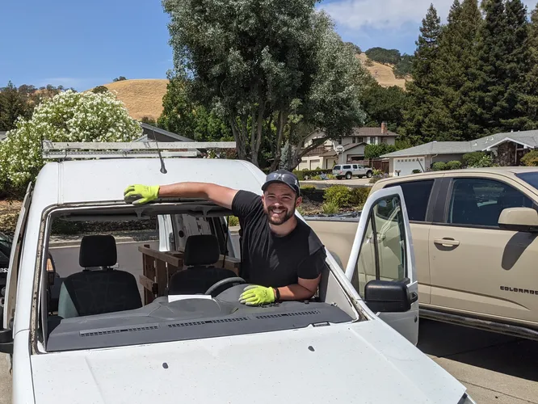

This website serves to document my 2013 Ford Transit Connect camper van conversion project. I purchased the van in San Jose, CA in 2017, built it out over the years, and used it as my camper and daily driver until I sold it in early 2025 in Las Vegas, NV. It has spent much of its life in the western US in addition to a few trips across the country.

Just as many other builds have inspired this one, if you have any questions about this build which may help with your project, feel free to reach out through through email or Instagram. I am also perpetually interested in other people's FTC builds, so please do not hesitate to share yours with me!

<figure>
  
</figure>
