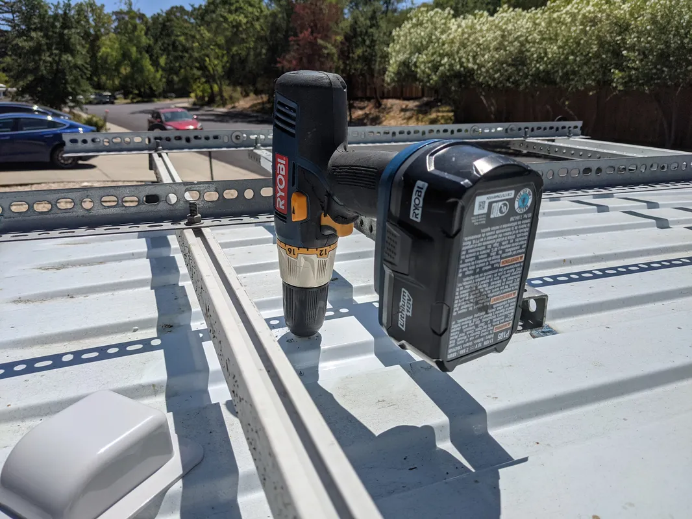
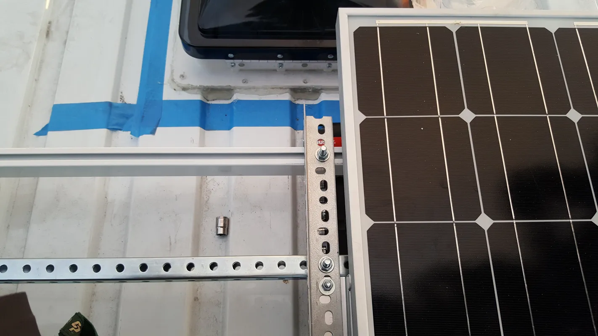
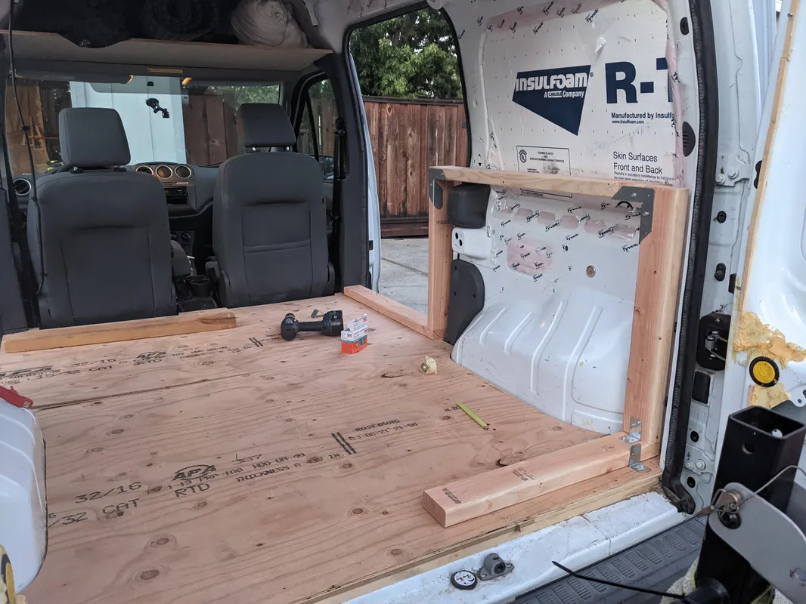
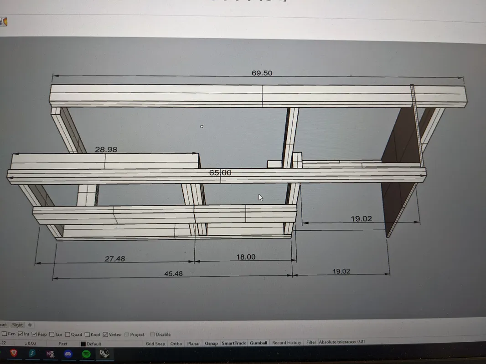
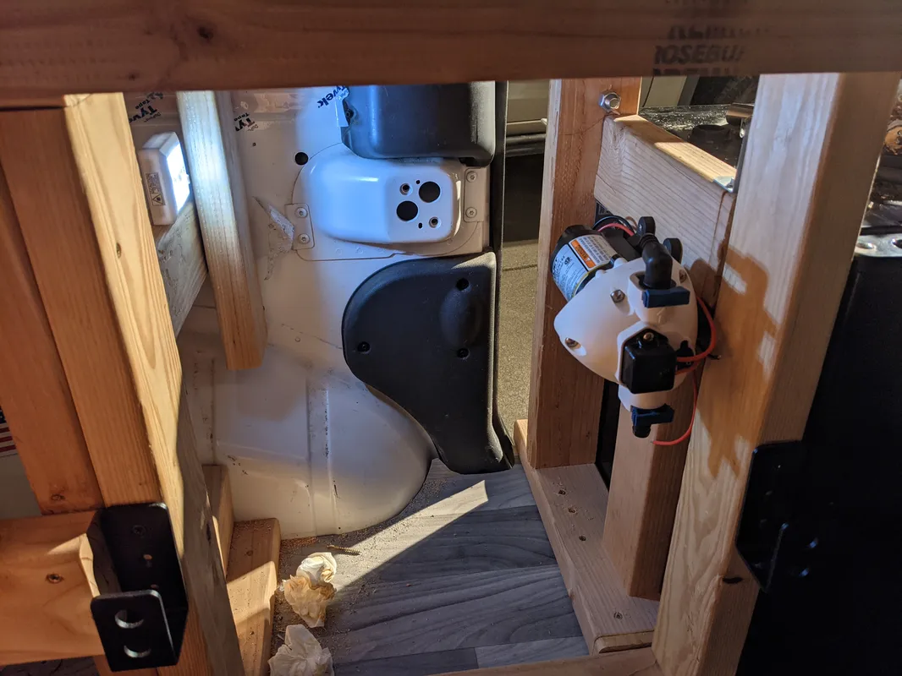
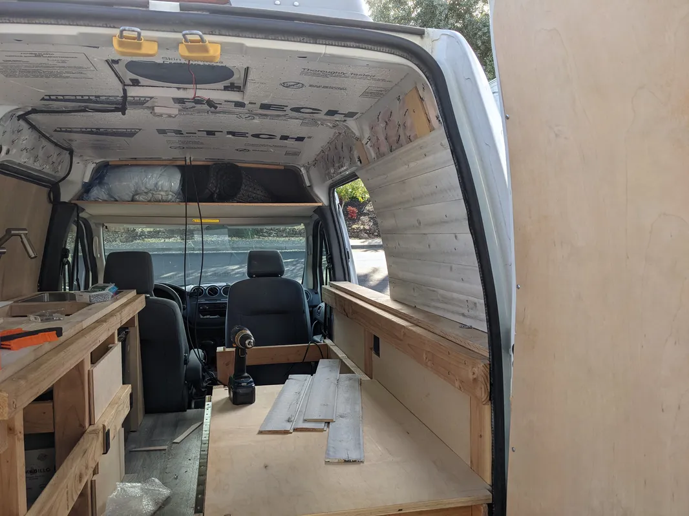
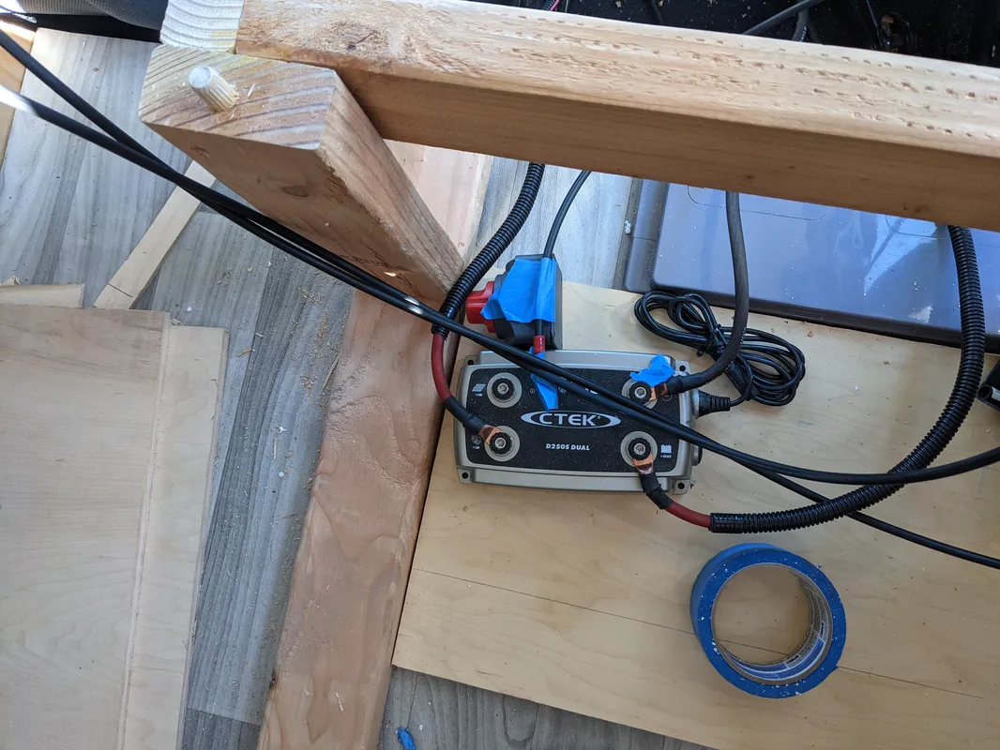
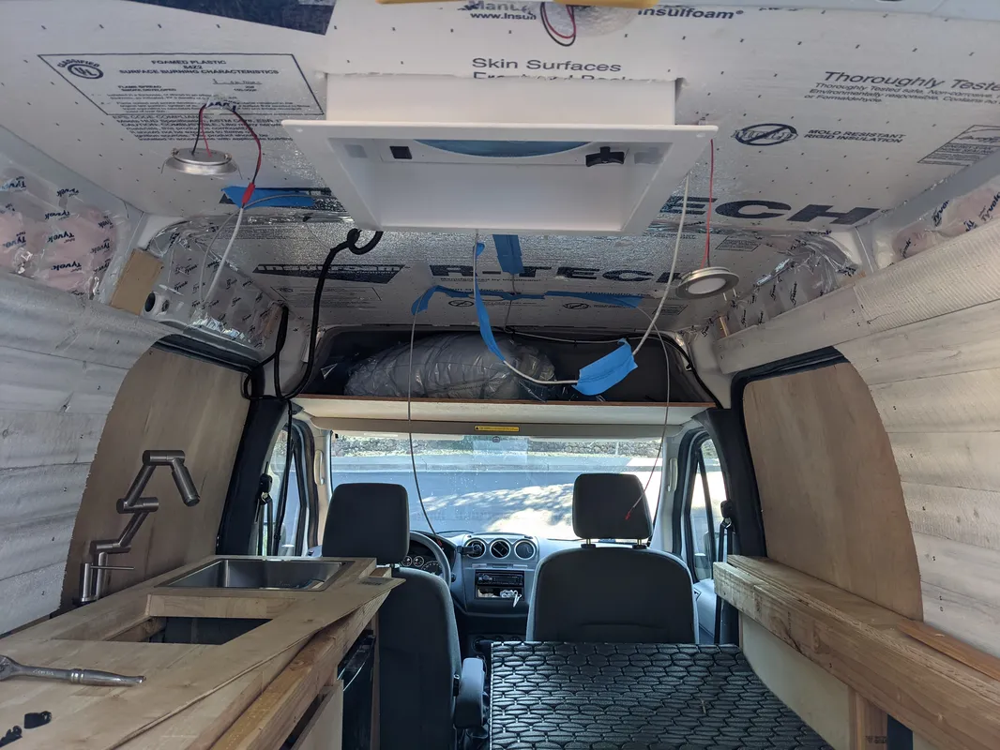

## Initial Tear Down
In preparation for the conversion, the felt ceiling liner, vinyl flooring mat, utility shelving, and door paneling were stripped down

<figure style="text-align: center; margin-bottom: 20px;">
  
  <figcaption style="color: grey; font-style: italic;" >View of the original interior as purchased, prior to conversion.</figcaption>
</figure>

## Substructure and Insulation

3/4" x 3/4" Wooden "beams" were epoxied down to the aluminum ridges on the van chassis cargo floor as the sub structure. In between the beams is a continuous infill of rigid insulation, with spray foam insulation in the seams and gaps. The height of the metal chassis ridges allowed the substructure and insulation to sit about and inch above the van's metal chassis floor, leaving a significant "air gap" which is a crucial element for a well insulated space.

<figure style="text-align: center; margin-bottom: 20px;">
  
   
  <figcaption style="color: grey; font-style: italic;" >Adhering wooden floor substructure to the metal ridges of the van's body.</figcaption>
</figure>

<figure style="text-align: center; margin-bottom: 20px;">
  
  <figcaption style="color: grey; font-style: italic;" >Adhering wooden floor substructure to the metal ridges of the van's body.</figcaption>
</figure>

<figure style="text-align: center; margin-bottom: 20px;">
  
  <figcaption style="color: grey; font-style: italic;" >Description for 20180117_205811.webp</figcaption>
</figure>

Similar to the floor, a layer of rigid foam insulation is adhered to the metal corrugated structural ridges of the chassis ceiling. By laminating the underside of these ridges, a significant air gap was left in-between the underside of the van's metal roof and the top of the insulation layer, maximizing the performance of the insulation layer. Additionally, the rigid foam has a thin layer of reflective foil on its top side, which helps mitigate the high amount of radiant heat coming from the sun on the roof. 

<figure style="text-align: center; margin-bottom: 20px;">
  
  <figcaption style="color: grey; font-style: italic;" >Temporary wooden shoring to hold the rigid insulation up as it adheres to the van's metal ceiling</figcaption>
</figure>

<figure style="text-align: center; margin-bottom: 20px;">
  
  <figcaption style="color: grey; font-style: italic;" >Rigid insulation installed in the ceiling, flush with the van's mid-chassis beam.</figcaption>
</figure>

The cavities of the van's chassis are filled with common pink batt fiberglass house insulation. To protect against moisture infiltration (which may collapse fiberglass or cause mold growth), all of the insulated cavities were sealed with Tyvek vapor barrier tape. Tyvek is commonly used on home construction for vapor mitigation such as this, and the tape is versatile enough for sticking to the van's metal body. Additionally, the Tyvek barrier completely seals off the insulation from the interior cabin, preventing any potential skin or lung irritation while inside the van.

<figure style="text-align: center; margin-bottom: 20px;">
  
  <figcaption style="color: grey; font-style: italic;" >Insulating the cavities with fiberglass insulation.</figcaption>
</figure>

<figure style="text-align: center; margin-bottom: 20px;">
  
  <figcaption style="color: grey; font-style: italic;" >Sealing with Tyvek vapor barrier tape.</figcaption>
</figure>

<figure style="text-align: center; margin-bottom: 20px;">
  
  <figcaption style="color: grey; font-style: italic;" >Insulation progress.</figcaption>
</figure>

<figure style="text-align: center; margin-bottom: 20px;">
  
  <figcaption style="color: grey; font-style: italic;" >Rigid insulation on flat surfaces, batt insulation in cavernous areas.</figcaption>
</figure>

<figure style="text-align: center; margin-bottom: 20px;">
  
  <figcaption style="color: grey; font-style: italic;" >Completed insulation with spray foam sanded down.</figcaption>
</figure>

## False Floor Removal

The 1st generation FTC was produced as both a passenger "mini van" in addition to the  cargo van model. The cargo van model comes with a steel false floor which is used to extend the floor of the cargo bay, and cover up the seating "foot well" which was needed for the rear seats of the passenger van. This false floor was permanently removed in this build, by cutting off the welded attachments. This opened up some valuable space behind the seats, where the fresh water tank and house battery were "sunk" below the rest of the furniture.

<figure style="text-align: center; margin-bottom: 20px;">
  
  <figcaption style="color: grey; font-style: italic;" >Passenger variant shown for reference.</figcaption>
</figure>

<figure style="text-align: center; margin-bottom: 20px;">
  
  <figcaption style="color: grey; font-style: italic;" >False floor on the cargo model prior to removal.</figcaption>
</figure>

<figure style="text-align: center; margin-bottom: 20px;">
  
  <figcaption style="color: grey; font-style: italic;">False floor after removal.</figcaption>
</figure>

## Door Paneling

The interior of the cabin doors are finished with a large plywood panel. The edges of the panel are wrapped with a rubber strip as a trim. The product used for the trim is  typically used for car door edge protection and easily "snaps" on to the edge of the plywood.

<figure style="text-align: center; margin-bottom: 20px;">
  
  <figcaption style="color: grey; font-style: italic;" >Left door plywood paneling.</figcaption>
</figure>

<figure style="text-align: center; margin-bottom: 20px;">
  
  <figcaption style="color: grey; font-style: italic;" >Right door plywood paneling.</figcaption>
</figure>

## Flooring

On top of the substructure is a continuous plywood flooring jigsawed to fit the exact contours of the van. The plywood is fastened down by drilling onto the substructure "beams." The thick plywood then serves as a surface for the furniture and other elements to be securely drilled down wherever needed.

<figure style="text-align: center; margin-bottom: 20px;">
  
  <figcaption style="color: grey; font-style: italic;" >Using this cool tool to get the exact contours. Forgot what it's called.</figcaption>
</figure>

<figure style="text-align: center; margin-bottom: 20px;">
  
  
  
  <figcaption style="color: grey; font-style: italic;" >Fitting the plywood floor in.</figcaption>
</figure>

<figure style="text-align: center; margin-bottom: 20px;">
  
  <figcaption style="color: grey; font-style: italic;" >Camping "test run" during the construction process.</figcaption>
</figure>

<figure style="text-align: center; margin-bottom: 20px;">
  
  <figcaption style="color: grey; font-style: italic;" >Creating a template on the uncut roll of vinyl flooring.</figcaption>
</figure>

<figure style="text-align: center; margin-bottom: 20px;">
  
  <figcaption style="color: grey; font-style: italic;" >Testing out dimensions on the floor before permanent installation.</figcaption>
</figure>

## Roof Construction

The van roof consists of three major elements: the roof fan, solar panel, and Thule storage box. The solar panel and Thule sit on a semi-custom roof rack. The FTC has fixed attachement points for roof racks, therefore the panel and Thule needed to be towards the front on these points, and the fan towards the back. This works out well because the fan will draw air in the back, from the cracked windows in the front, and create a nice cross ventilation across the length of the van.

The main roof rack is a standard Van Tech rack with two bars spanning across the fixed attachment points. The challenge with the FTC was attaching the Thule and solar panel to a rack system with a fixed spacing. The solution was spanning a system of steel slotted angles and channels across the rack, to give the flexibility of different attachment points. 

A large hole was cut out of the back of the roof to house the fan. The fan is drilled into the roof per installation specs, and is weatherproofed with roofing putty and roofing sealant caulking. Additionally, two small holes were drilled towards the front of the roof for the positive and negative solar panel cables. The holes are protected by a waterproof solar cable gland, with is adhered down with 3M strips and further weatherproofed with roofing sealant caulking.

<figure style="text-align: center; margin-bottom: 20px;">
  
  <figcaption style="color: grey; font-style: italic;" >Description for 20180212_215603.webp</figcaption>
</figure>

<figure style="text-align: center; margin-bottom: 20px;">
  
  
  
  <figcaption style="color: grey; font-style: italic;" >Cutting a hole in the roof. The air gap between the insulation and roof can also be seen here.</figcaption>
</figure>

<figure style="text-align: center; margin-bottom: 20px;">
  
  
  <figcaption style="color: grey; font-style: italic;" >The installed roof fan, with the "fixed" Van Tech roof rack in the back.</figcaption>
</figure>

<figure style="text-align: center; margin-bottom: 20px;">
  
  <figcaption style="color: grey; font-style: italic;" >Running the fan's electrical cables to the house battery in the front of the van.</figcaption>
</figure>

<figure style="text-align: center; margin-bottom: 20px;">
  
  <figcaption style="color: grey; font-style: italic;" >Sealing the fan assembly with weatherproofing sealant.</figcaption>
</figure>

<figure style="text-align: center; margin-bottom: 20px;">
  
  <figcaption style="color: grey; font-style: italic;" >Drilling holes for the solar panel cables. Attachment of steel angles to Van Tech rack also shown.</figcaption>
</figure>

<figure style="text-align: center; margin-bottom: 20px;">
  
  
  <figcaption style="color: grey; font-style: italic;" >Installing the gland to protect the cable entry points.</figcaption>
</figure>

<figure style="text-align: center; margin-bottom: 20px;">
  
  <figcaption style="color: grey; font-style: italic;" >Installing the in-line solar fuse in a weatherproof housing.</figcaption>
</figure>

<figure style="text-align: center; margin-bottom: 20px;">
  
  
  
  <figcaption style="color: grey; font-style: italic;" >Installing the solar panel on the slotted steel angles.</figcaption>
</figure>

<figure style="text-align: center; margin-bottom: 20px;">
  
  <figcaption style="color: grey; font-style: italic;" >Spanning steel slotted channels between the angles as attachment points for the Thule</figcaption>
</figure>

<figure style="text-align: center; margin-bottom: 20px;">
  
  <figcaption style="color: grey; font-style: italic;" >Thule attached to the slotted channels, and resting on the Van Tech rack.</figcaption>
</figure>

<figure style="text-align: center; margin-bottom: 20px;">
  
  <figcaption style="color: grey; font-style: italic;" >Finished roof configuration.</figcaption>
</figure>

## Interior Framing

The furniture is largely built with standard 2x4's fastened to each other with strong-tie connectors and structural screws. The framing was designed in a digital model down to the 1/4", ensuring the tolerances for things like the modular squares, and kitchen appliances were accounted for.

<figure style="text-align: center; margin-bottom: 20px;">
  
  
  <figcaption style="color: grey; font-style: italic;" >Framing the bench with 2x4 and strong-tie connections.</figcaption>
</figure>

<figure style="text-align: center; margin-bottom: 20px;">
  
  
  <figcaption style="color: grey; font-style: italic;" >3D digital model of the framing design for the bench and kitchen.</figcaption>
</figure>

<figure style="text-align: center; margin-bottom: 20px;">
  
  
  <figcaption style="color: grey; font-style: italic;" >Finished framing prior to paneling and kitchen carpentry.</figcaption>
</figure>

## Kitchen Build

The kitchen has a large butcher block counter top installed, to simultaneously serve as a food-safe surface for cooking, and as a sturdy platform extension for the "Queen Camping" configuration. The drawers and cabinetry are made of plywood. On the side of the kitchen facing the bench, are 2x4 ledges running the length of the cabin, structurally fastened to the framing, for the sleeping platforms to sit on.

<figure style="text-align: center; margin-bottom: 20px;">
  
  <figcaption style="color: grey; font-style: italic;" >Installing the butcher block counter top.</figcaption>
</figure>

<figure style="text-align: center; margin-bottom: 20px;">
  
  
  <figcaption style="color: grey; font-style: italic;" >Cutting holes in the countertop for the sink and burner basin to sit in. Fitting for the grey water tank and mini-fridge also shown.</figcaption>
</figure>

<figure style="text-align: center; margin-bottom: 20px;">
  
  
  
  <figcaption style="color: grey; font-style: italic;" >Fitting and installing the sink faucet and sink pump, connected with food-safe pvc tubing.</figcaption>
</figure>

<figure style="text-align: center; margin-bottom: 20px;">
  
  <figcaption style="color: grey; font-style: italic;" >Mounting the sink faucet on a steel angle bracket behind and below the counter, to keep it out of the way for the "Queen Camping" mode.</figcaption>
</figure>

## Interior Paneling

On top of the interior van surface, there are a series of thin wood battens which serve as the blocking for interior paneling. The ship-lap siding is screwed into these battens and custom cut to fit the contours of the van. The ceiling is a thin sheet of plywood attached to the van with strong-tie connections.

<figure style="text-align: center; margin-bottom: 20px;">
  
  
  
  <figcaption style="color: grey; font-style: italic;" >Ship-lap siding fastened to wooden battens for blocking.</figcaption>
</figure>

<figure style="text-align: center; margin-bottom: 20px;">
  
  <figcaption style="color: grey; font-style: italic;" >Paneling progress, showings layers of wall construction.</figcaption>
</figure>

<figure style="text-align: center; margin-bottom: 20px;">
  
  <figcaption style="color: grey; font-style: italic;" >Cutting the ceiling finish to fit fan, lighting, and van contouring.</figcaption>
</figure>

## Electrical Wiring

Prior to the final ceiling installation, the solar wiring from the roof and recessed puck lights were configured, which were later recessed and concealed within the ceiling.

<figure style="text-align: center; margin-bottom: 20px;">
  
  <figcaption style="color: grey; font-style: italic;" >Designing the electrical system.</figcaption>
</figure>

<figure style="text-align: center; margin-bottom: 20px;">
  
  <figcaption style="color: grey; font-style: italic;" >Wiring up the CTEK battery charger with solar and alternator power.</figcaption>
</figure>

<figure style="text-align: center; margin-bottom: 20px;">
  
  <figcaption style="color: grey; font-style: italic;" >Roughing in the lighting and trim for the fan in anticipation of the ceiling panel.</figcaption>
</figure>

<figure style="text-align: center; margin-bottom: 20px;">
  
  
  <figcaption style="color: grey; font-style: italic;" >Testing the finished lighting and electrical system.</figcaption>
</figure>

## Kitchen Carpentry

The plywood drawers are built with plywood and installed with slow-close sliders in the largest part of the kitchen framing. As a finishing touch, the butcher block counter top was extended with a custom fitting for the sink and soap dispenser, to take advantage of every 1/4" against the sliding door

<figure style="text-align: center; margin-bottom: 20px;">
  
  <figcaption style="color: grey; font-style: italic;" >Building the kitchen drawers.</figcaption>
</figure>

<figure style="text-align: center; margin-bottom: 20px;">
  
  <figcaption style="color: grey; font-style: italic;" >Final fitting of kitchen sink and soap dispenser.</figcaption>
</figure>
