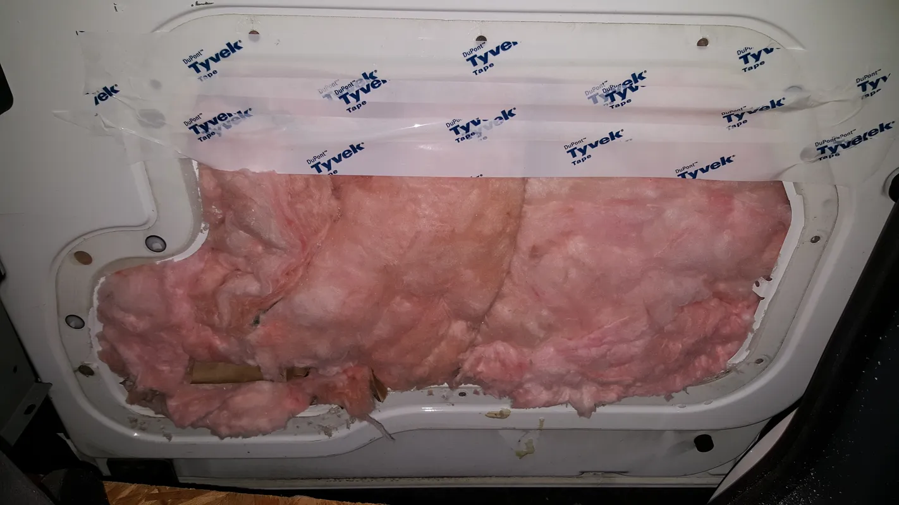
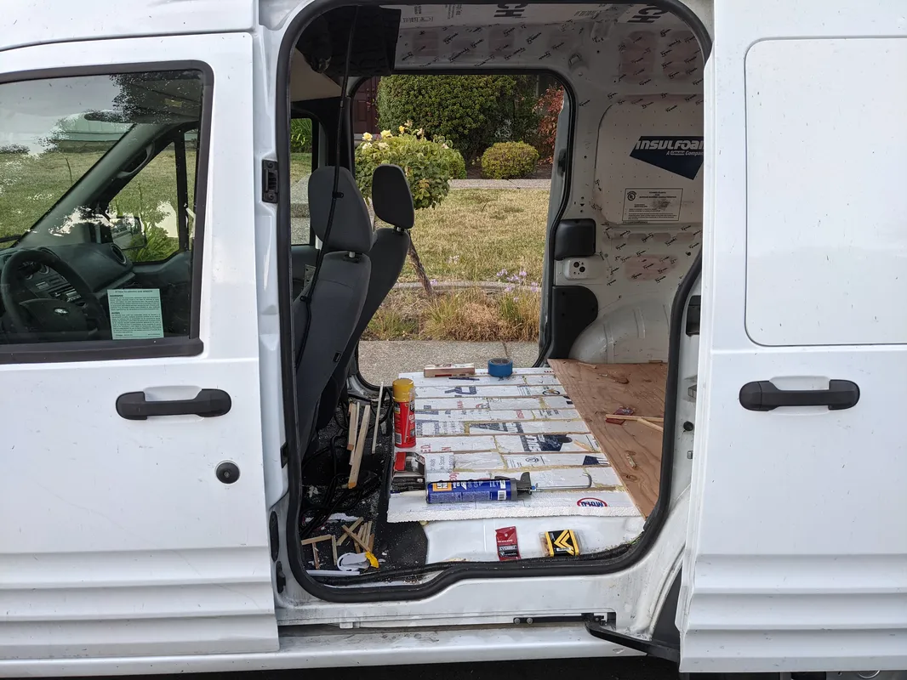
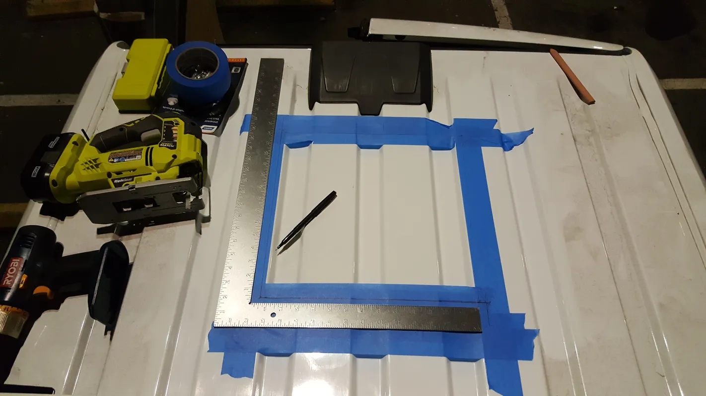
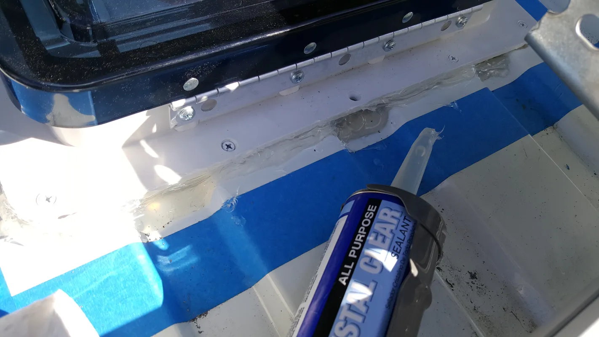
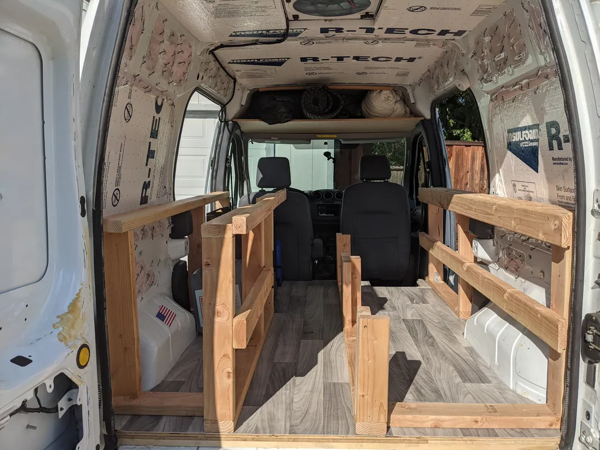

A journal of  van conversion.

## Initial Tear Down. 
In preparation for the conversion, the felt ceiling liner, vinyl flooring mat, utility shelving, and door paneling were stripped down

<figure style="text-align: center;">
  
  <figcaption>View of the original interior as purchased, prior to conversion.</figcaption>
</figure>

## Substructure and insulation. 

<figure style="text-align: center;">
  
   
  <figcaption>Adhering wooden floor substructure to the metal ridges of the van's body.</figcaption>
</figure>

<figure style="text-align: center;">
  
  <figcaption>Adhering wooden floor substructure to the metal ridges of the van's body.</figcaption>
</figure>

<figure style="text-align: center;">
  
  <figcaption>Description for 20180117_205811.webp</figcaption>
</figure>

<figure style="text-align: center;">
  
  <figcaption>Description for 20180117_220407.webp</figcaption>
</figure>

<figure style="text-align: center;">
  
  <figcaption>Description for 20180118_214654.webp</figcaption>
</figure>

<figure style="text-align: center;">
  
  <figcaption>Description for 20180120_205034.webp</figcaption>
</figure>

<figure style="text-align: center;">
  
  <figcaption>Description for 20180121_144830.webp</figcaption>
</figure>

<figure style="text-align: center;">
  
  <figcaption>Description for 20180121_173847.webp</figcaption>
</figure>

<figure style="text-align: center;">
  
  <figcaption>Description for 20180121_180403.webp</figcaption>
</figure>

<figure style="text-align: center;">
  
  <figcaption>Description for 20180127_124257.webp</figcaption>
</figure>

<figure style="text-align: center;">
  
  <figcaption>Description for PXL_20210717_194054897.webp</figcaption>
</figure>

<figure style="text-align: center;">
  
  <figcaption>Description for PXL_20210521_040450683.webp</figcaption>
</figure>

<figure style="text-align: center;">
  
  <figcaption>Description for PXL_20210218_042334766.webp</figcaption>
</figure>

<figure style="text-align: center;">
  
  <figcaption>Description for PXL_20210714_034443970.webp</figcaption>
</figure>

<figure style="text-align: center;">
  
  <figcaption>Description for PXL_20210717_032310120.webp</figcaption>
</figure>

<figure style="text-align: center;">
  
  <figcaption>Description for PXL_20210718_212413192.webp</figcaption>
</figure>

## Door Paneling

<figure style="text-align: center;">
  
  <figcaption>Description for PXL_20210713_044703074.NIGHT.webp</figcaption>
</figure>

<figure style="text-align: center;">
  
  <figcaption>Description for PXL_20210718_023145177.webp</figcaption>
</figure>

## Subflooring Installation

<figure style="text-align: center;">
  
  <figcaption>Description for PXL_20210521_030649750.webp</figcaption>
</figure>

<figure style="text-align: center;">
  
  <figcaption>Description for PXL_20210522_205339054.webp</figcaption>
</figure>

<figure style="text-align: center;">
  
  <figcaption>Description for PXL_20210522_205347644.webp</figcaption>
</figure>

<figure style="text-align: center;">
  
  <figcaption>Description for PXL_20210522_205355872.webp</figcaption>
</figure>

<figure style="text-align: center;">
  
  <figcaption>Description for PXL_20210528_001950361.webp</figcaption>
</figure>

<figure style="text-align: center;">
  
  <figcaption>Description for PXL_20210717_043914270.webp</figcaption>
</figure>

<figure style="text-align: center;">
  
  <figcaption>Description for PXL_20210717_044959975.webp</figcaption>
</figure>

## Roof Construction. 

<figure style="text-align: center;">
  
  <figcaption>Description for 20180212_215603.webp</figcaption>
</figure>

<figure style="text-align: center;">
  
  <figcaption>Description for 20180212_221938.webp</figcaption>
</figure>

<figure style="text-align: center;">
  
  <figcaption>Description for 20180212_222631.webp</figcaption>
</figure>

<figure style="text-align: center;">
  
  <figcaption>Description for 20180212_222718.webp</figcaption>
</figure>

<figure style="text-align: center;">
  
  <figcaption>Description for 20180212_222818.webp</figcaption>
</figure>

<figure style="text-align: center;">
  
  <figcaption>Description for 20180212_232440.webp</figcaption>
</figure>

<figure style="text-align: center;">
  
  <figcaption>Description for 20180217_191259.webp</figcaption>
</figure>

<figure style="text-align: center;">
  
  <figcaption>Description for 20180218_140156.webp</figcaption>
</figure>

<figure style="text-align: center;">
  
  <figcaption>Description for PXL_20210801_210723403.webp</figcaption>
</figure>

<figure style="text-align: center;">
  
  <figcaption>Description for PXL_20210801_221114066.webp</figcaption>
</figure>

<figure style="text-align: center;">
  
  <figcaption>Description for PXL_20210801_223534211.webp</figcaption>
</figure>

<figure style="text-align: center;">
  
  <figcaption>Description for PXL_20210801_212737857.webp</figcaption>
</figure>

<figure style="text-align: center;">
  
  <figcaption>Description for 20180217_190914.webp</figcaption>
</figure>

<figure style="text-align: center;">
  
  <figcaption>Description for 20180219_174053.webp</figcaption>
</figure>

<figure style="text-align: center;">
  
  <figcaption>Description for 20180219_174104.webp</figcaption>
</figure>

<figure style="text-align: center;">
  
  <figcaption>Description for 20180219_174454.webp</figcaption>
</figure>

<figure style="text-align: center;">
  
  <figcaption>Description for 20180226_064018.webp</figcaption>
</figure>

<figure style="text-align: center;">
  
  <figcaption>Description for 20180306_072019.webp</figcaption>
</figure>

## Interior Framing

<figure style="text-align: center;">
  
  <figcaption>Description for PXL_20210630_034630090.webp</figcaption>
</figure>

<figure style="text-align: center;">
  
  <figcaption>Description for PXL_20210704_031708107.webp</figcaption>
</figure>

<figure style="text-align: center;">
  
  <figcaption>Description for PXL_20210717_225829792.webp</figcaption>
</figure>

<figure style="text-align: center;">
  
  <figcaption>Description for PXL_20210718_234946426.webp</figcaption>
</figure>

<figure style="text-align: center;">
  
  <figcaption>Description for PXL_20210719_005003818.webp</figcaption>
</figure>

<figure style="text-align: center;">
  
  <figcaption>Description for PXL_20210719_043404538.NIGHT.webp</figcaption>
</figure>

<figure style="text-align: center;">
  
  <figcaption>Description for PXL_20210729_022753330.webp</figcaption>
</figure>

## Kitchen Build out

<figure style="text-align: center;">
  
  <figcaption>Description for PXL_20210719_021738484.webp</figcaption>
</figure>

<figure style="text-align: center;">
  
  <figcaption>Description for PXL_20210719_045438304.webp</figcaption>
</figure>

<figure style="text-align: center;">
  
  <figcaption>Description for PXL_20210724_175851172.webp</figcaption>
</figure>

<figure style="text-align: center;">
  
  <figcaption>Description for PXL_20210727_225931774.webp</figcaption>
</figure>

<figure style="text-align: center;">
  
  <figcaption>Description for PXL_20210728_044851098.NIGHT.webp</figcaption>
</figure>

<figure style="text-align: center;">
  
  <figcaption>Description for PXL_20210729_185202992.webp</figcaption>
</figure>

<figure style="text-align: center;">
  
  <figcaption>Description for PXL_20210729_214729612.webp</figcaption>
</figure>

<figure style="text-align: center;">
  
  <figcaption>Description for PXL_20210730_023737343.webp</figcaption>
</figure>

## Interior Paneling

<figure style="text-align: center;">
  
  <figcaption>Description for PXL_20210803_010955173.webp</figcaption>
</figure>

<figure style="text-align: center;">
  
  <figcaption>Description for PXL_20210803_012702892.webp</figcaption>
</figure>

<figure style="text-align: center;">
  
  <figcaption>Description for PXL_20210803_014316616.webp</figcaption>
</figure>

<figure style="text-align: center;">
  
  <figcaption>Description for PXL_20210803_031009822.webp</figcaption>
</figure>

<figure style="text-align: center;">
  
  <figcaption>Description for PXL_20210805_022733652.webp</figcaption>
</figure>

<figure style="text-align: center;">
  
  <figcaption>Description for PXL_20210805_233516848.webp</figcaption>
</figure>

<figure style="text-align: center;">
  
  <figcaption>Description for PXL_20210806_013825387.webp</figcaption>
</figure>

## Electrical Wiring

<figure style="text-align: center;">
  
  <figcaption>Description for PXL_20210803_164416588.webp</figcaption>
</figure>

<figure style="text-align: center;">
  
  <figcaption>Description for PXL_20210803_172936181.webp</figcaption>
</figure>

<figure style="text-align: center;">
  
  <figcaption>Description for PXL_20210806_013900020.webp</figcaption>
</figure>

<figure style="text-align: center;">
  
  <figcaption>Description for PXL_20210808_032428477.webp</figcaption>
</figure>

<figure style="text-align: center;">
  
  <figcaption>Description for PXL_20210808_035431007.NIGHT.webp</figcaption>
</figure>

## Kitchen Carpentry

<figure style="text-align: center;">
  
  <figcaption>Description for PXL_20210808_023744442.webp</figcaption>
</figure>

<figure style="text-align: center;">
  
  <figcaption>Description for PXL_20210809_033936335.webp</figcaption>
</figure>
